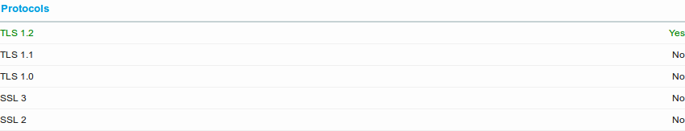
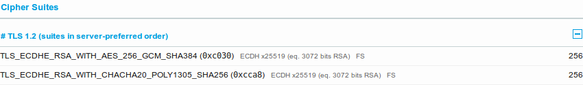
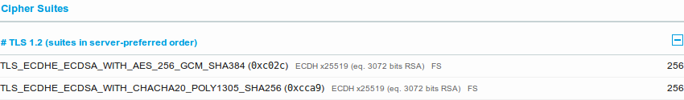
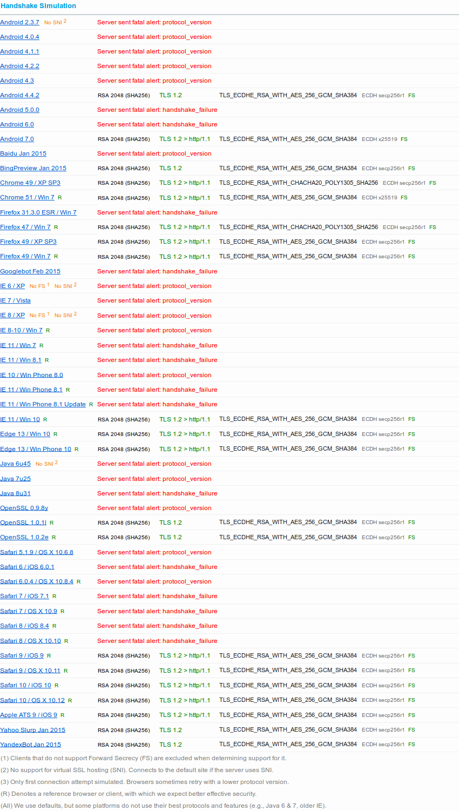
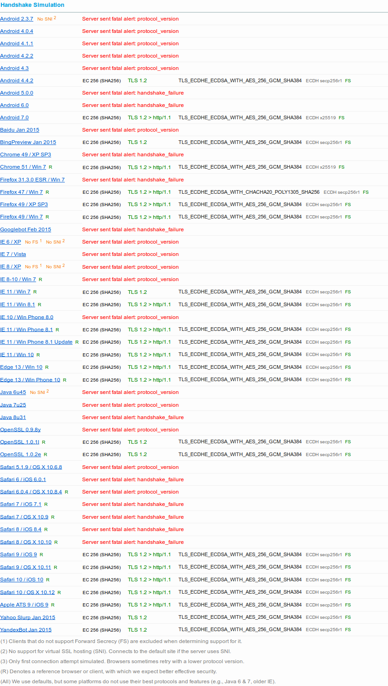

# tlsstrict

A sane, common, strict and secure TLS configuration for Golang projects.

It is intended for internal communication between private services.

## Protocols

## Cipher Suites

### RSA

### ECDSA

## Curves

## Handshake Simulation

### RSA

### ECDSA

